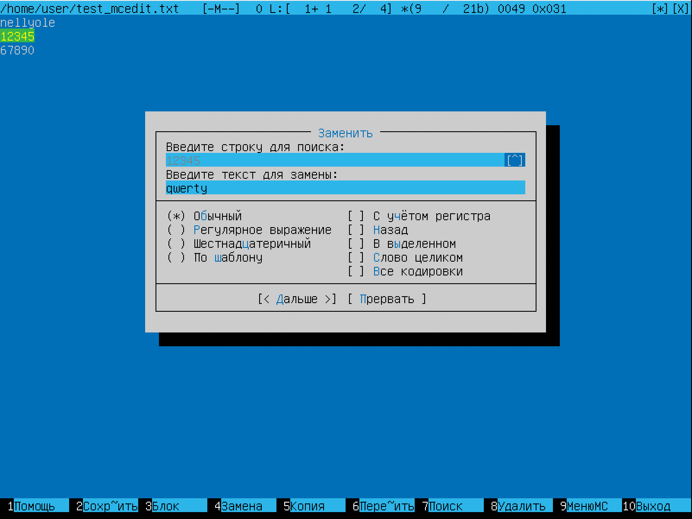
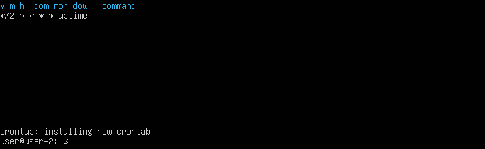

# Операционные системы UNIX/Linux (Базовый).

В качестве результата работы должен быть предоставлен отчет по выполненным задачам. В каждой части задания указано, что должно быть помещено в отчёт, после её выполнения. Это могут быть скриншоты, какие-то данные и т.д.
- В репозиторий, в папку src, должен быть загружен отчёт с расширением .md.
- В отчёте должны быть выделены все части задания, как заголовки 2-го уровня.
- В рамках одной части задания всё, что помещается в отчёт, должно быть оформлено в виде списка.
- Каждый скриншот в отчёте должен быть кратко подписан (что показано на скриншоте).
- Все скриншоты обрезаны так, чтобы была видна только нужная часть экрана.

## Part 1. Установка ОС

<a id="start"></a>
# __D01_Linux__
### Навигация
* [Part 1. Установка ОС](#p1)
* [Part 2. Создание пользователя](#p2)
* [Part 3. Настройка сети ОС](#p3)
* [Part 4. Обновление ОС](#p4)
* [Part 5. Использование команды sudo](#p5)
* [Part 6. Установка и настройка службы времени](#p6)
* [Part 7. Установка и использование текстовых редакторов](#p7)
* [Part 8. Установка и базовая настройка сервиса SSHD](#p8)
* [Part 9. Установка и использование утилит top, htop](#p9)
* [Part 10. Использование утилиты fdisk](#p10)
* [Part 11. Использование утилиты df](#p11)
* [Part 12. Использование утилиты du](#p12)
* [Part 13. Установка и использование утилиты ncdu](#p13)
* [Part 14. Работа с системными журналами](#p14)
* [Part 15. Использование планировщика заданий CRON](#p15)

<a id="p1"></a>
## Part 1. Установка ОС

  - 

<a id="p2"></a>
## Part 2. Создание пользователя
1.  скриншот вызова команды для создания пользователя.

  - 

2.  Новый пользователь должен быть в выводе команды ([Part 5](#part-5-использование-команды-sudo))

        `cat /etc/passwd`

3.  скриншот с выводом команды.

  - 

<a id="p3"></a>
## Part 3. Настройка сети ОС

1. Задать название машины вида user-1

  - 

2.  Установить временную зону, соответствующую вашему текущему местоположению.

  - 

3. Вывести названия сетевых интерфейсов с помощью консольной команды.

  - 

- Дать объяснение наличию интерфейса lo.  
    В телекоммуникациях loopback (коротко говоря loop) — это аппаратный или программный метод, который направляет полученный сигнал или данные обратно отправителю. Он используется как дополнительное средство в исправлении проблем физического соединения. В качестве теста многие устройства для передачи данных могут быть сконфигурированы для отправки специальных шаблонов на интерфейс и могут ловить отклик на этот сигнал на том же порту. Это называется тест loopback и может быть выполнено на модеме или трансивере путём соединения его выхода с его собственным входом. Для тестирования цепи между двумя точками применяется тестовый сигнал в одной точке цепи, и при наличии сетевого устройства в другой точке сигнал посылается обратно через цепь. Если первое устройство получит свой собственный сигнал обратно, это докажет, что цепь функционирует.

4.  Используя консольную команду получить ip адрес устройства, на котором вы работаете, от DHCP сервера.

  - 

- В отчёте дать расшифровку DHCP.
    
    — прикладной протокол, позволяющий сетевым устройствам автоматически получать IP-адрес и другие параметры, необходимые для работы в сети TCP/IP. Данный протокол работает по модели «клиент-сервер». Для автоматической конфигурации компьютер-клиент на этапе конфигурации сетевого устройства обращается к так называемому серверу DHCP и получает от него нужные параметры

5.  Определить и вывести на экран внешний ip-адрес шлюза (ip) и внутренний IP-адрес шлюза, он же ip-адрес по умолчанию (gw).

  - 

6. Задать статичные (заданные вручную, а не полученные от DHCP сервера) настройки ip, gw, dns (использовать публичный DNS серверы, например 1.1.1.1 или 8.8.8.8).

        `sudo vim /etc/netplan/00-installer-config.yaml`

  - 
  - 

  - 


7. Перезагрузить виртуальную машину. Убедиться, что статичные сетевые настройки (ip, gw, dns) соответствуют заданным в предыдущем пункте.  


  - 

- В отчёте опишите, что сделали для выполнения всех семи пунктов (можно как текстом, так и скриншотами).
- Успешно пропинговать удаленные хосты 1.1.1.1 и ya.ru и вставить в отчёт скрин с выводом команды.

  - 

<a id="p4"></a>
## Part 4. Обновление ОС

1. После обновления системных пакетов, если ввести команду обновления повторно, должно появится сообщение, что обновления отсутствуют.
2. Вставить скриншот с этим сообщением в отчёт.

```
sudo apt update
sudo apt upgrade
sudo apt update
sudo apt upgrade
```

  - 
  - 
  - 


<a id="p5"></a>
## Part 5. Использование команды sudo

##### Разрешить пользователю, созданному в [Part 2](#part-2-создание-пользователя), выполнять команду sudo. 

1. sudo (англ. Substitute User and do, дословно «подменить пользователя и выполнить») — программа для системного администрирования UNIX-систем, позволяющая делегировать те или иные привилегированные ресурсы пользователям с ведением протокола работы. Основная идея — дать пользователям как можно меньше прав, при этом достаточных для решения поставленных задач. Программа поставляется для большинства UNIX и UNIX-подобных операционных систем.

    Команда sudo предоставляет возможность пользователям выполнять команды от имени суперпользователя root, либо других пользователей. Правила, используемые sudo для принятия решения о предоставлении доступа, находятся в файле /etc/sudoers, язык их написания и примеры использования подробно изложены в man sudoers.
    В большинстве случаев грамотная настройка sudo делает небезопасную работу от имени суперпользователя ненужной. Все действия оказываются выполнимы из-под аккаунта пользователя, которому разрешено использовать sudo без ограничений. Имеется возможность запрещать и разрешать определённым пользователям или группам выполнение конкретного набора программ, а также разрешить выполнение определённых программ без необходимости ввода своего пароля.

2. Поменять hostname ОС от имени пользователя, созданного в пункте [Part 2](#part-2-создание-пользователя). (используя sudo).
3.  Вставить скрин с изменённым hostname в отчёт.
  - 
  - 
  - 
      ```
      reboot
      ```
    - 

  <!--  -->

<a id="p6"></a>
## Part 6. Установка и настройка службы времени 

1. Вывести время, часового пояса, в котором вы сейчас находитесь.
2. Вывод следующей команды должен содержать `NTPSynchronized=yes`: \
  `timedatectl status`
3. Вставить скрины с корректным временем и выводом команды в отчёт.

      


<a id="p7"></a>
## Part 7. Установка и использование текстовых редакторов

**== VIM ==**

1. - 
2. - 
3. - 
4. - 
4. - 
5. 
    > vim test_vim.txt
    > 
    > Нажать i
    > 
    > Вписать ник
    > 
    > Нажать ESC, затем  :, затем набрать wq и нажать Enter
    > 
    > Выход без сохранения:
    > Вместо wq пишим q!
    > 
    > Поиск:
    > Без перехода в режим вставки, нажать /<текст поиска>
    > 
    > Замена:
    > Без перехода в режим вставки, нажать :s/<текст поиска>/<текст замены>

**== NANO ==**

1. - 
2. - 
3. - 
3. - 
3. - 
3. - 
4. 
    > nano test_nano.txt
    > 
    > Вписать ник
    > 
    > Нажать Ctrl + O, Enter, затем Ctrl + X
    > 
    > Выход без сохранения:
    > Нажать Ctrl + X, затем N
    > 
    > Поиск:
    > Ctrl + W
    > 
    > Замена:
    > Option + R

**== MCEDIT ==**

1. - 
2. - 
3. - 
3. - 
3. - 
3. - 
4. 
    > mcedit test_mcedit.txt
    > 
    > Вписать ник
    > 
    > Нажать F10
    > выбрать "yes" или "да"
    > 
    > Выход без сохранения:
    > Выбрать "no" или "нет"
    > 
    > Поиск:
    > F7
    > 
    > Замена:
    > F4


<a id="p8"></a>
## Part 8. Установка и базовая настройка сервиса SSHD

1. `sudo apt-get install ssh`
2. `sudo systemctl enable ssh ( добавить в автозагрузку,  sudo systemctl disable sshd - удалить)`
3. - 
3. - 
3. - 
3. - 
    > -p  proclist
    > 
    > Select by PID.  This selects the processes whose process. ID numbers appear in pidlist.  Identical to p and --pid.
    Выберите по PID. При этом выбираются процессы, процесс которых. Идентификационные номера отображаются в pidlist. Идентично p и --pid.
5. `reboot`
6.  - 
6.  - 
6.  - 
    > 
  >  NETSTAT - статистика активных подключений TCP
  >
  > -a - вывод всех активных подключений TCP и прослушиваемых компьютером портов TCP и UDP
  >
  > -n - вывод активных подключений TCP с отображением адресов и номеров портов в числовом формате без попыток определения имен
 --numeric , -n
  > Показывать сетевые адреса как числа
  > 
  > -a, --all   Показывать состояние всех сокетов
  > 
  > -t --tcp оторбразить только соединения по tcp
  > Output Columns
  > Proto - использумый сокетом протокол.
  >
  > Recv-Q - показывает количество байт не копированных программой приконекченной к сокету.
  >
  >Send-Q - показывает кол-во байт не признанных(подтвержденных) удаленным хостом.
  >
  > Local Address - IP-адрес локального компьютера и используемый номер порта
  Foreign Address - IP-адрес и номер порта удаленного компьютера, к которому подключен сокет.
  >
  >State - состояние сокета.
  > 0.0.0.0 - Это не маршрутизируемый мета-адрес, который используется для определения неизвестного или недействительного целевого объекта. Если говорить о серверах, то 0.0.0.0 означает все адреса IPv4 на локальной машине. В случае записи маршрута это означает маршрут по умолчанию.


<a id="p9"></a>
## Part 9. Установка и использование утилит top, htop

- Установить и запустить утилиты top и htop.  

1. По выводу команды top определить и написать в отчёте:
  - uptime : 59 min
  - 
  - 
  - количество авторизованных пользователей: `1`
  - общую загрузку системы: `0.00, 0.00, 0.00`
  - общее количество процессов: `99`
  - загрузку cpu: `0,0`
  - загрузку памяти: `188,8`
  - pid процесса занимающего больше всего памяти: `636`
  > top -o %MEM
  - pid процесса, занимающего больше всего процессорного времени: `376`
  > top -o %CPU


2. В отчёт вставить скрин с выводом команды htop:

- отсортированному по PID, PERCENT_CPU, PERSENT_MEM, TIME
  - 
  - 
  - 
  - 
- отфильтрованному для процесса sshd
  - 
- с процессом syslog, найденным, используя поиск
  - 
  - 
- с добавленным выводом hostname, clock и uptime
  - 

<a id="p10"></a>
## Part 10. Использование утилиты fdisk

1. название жесткого диска `VBOX HARDDISK`
2. его размер `8GIB`
3. количество секторов `16777216`
4. размер swap `923Mi`
- 
<a id="p11"></a>
## Part 11. Использование утилиты df

1. Запустить команду df.

2. В отчёте написать для корневого раздела (/):
  - размер раздела : `6352332`
  - размер занятого пространства : `3967580`
  - размер свободного пространства : `2040896`
  - процент использования: `67`
  - единица измерения в выводе: `Килобайт`
  

3. Запустить команду df -Th.
  - размер раздела : `6.1G`
  - размер занятого пространства : `3.8G`
  - размер свободного пространства : `2.0G`
  - процент использования : `67`
  - тип файловой системы для раздела : `ext4`
  
  

<a id="p12"></a>
  ## Part 12. Использование утилиты du
  
  1. `sudo apt-get install ncdu`
  2. Вывести размер папок /home, /var, /var/log (в байтах, в человекочитаемом виде)
  - 
  - 
  3. Вывести размер всего содержимого в /var/log (не общее, а каждого вложенного элемента, используя *)
  - 

<a id="p13"></a>
  ## Part 13. Установка и использование утилиты ncdu

1. `sudo apt-get install ncdu`
2. - 
3. - 
4. - 

<a id="p14"></a>
  ## Part 14. Работа с системными журналами

1. имя пользователя `user`
2. метод входа в систему: `LOGIN`
3. время входа `19:31:41`
  - 


. Перезапустить службу SSHd.
> `service ssh restart`

. Вставить в отчёт скрин с сообщением о рестарте службы (искать в логах).

  - 

<a id="p15"></a>
 ## Part 15. Использование планировщика заданий CRON
  - Используя планировщик заданий, запустите команду uptime через каждые 2 минуты.


  >`crontab -e`

  - 

  - Вывести на экран список текущих заданий для CRON.

  - Найти в системных журналах строчки (минимум две в заданном временном диапазоне)

  - 

  -  Вывести на экран список текущих заданий для CRON.
  - 

  - Вставить в отчёт скрины со строчками о выполнении и списком текущих задач.
  - 

  - Удалите все задания из планировщика заданий.

  - В отчёт вставьте скрин со списком текущих заданий для CRON.

  - 
